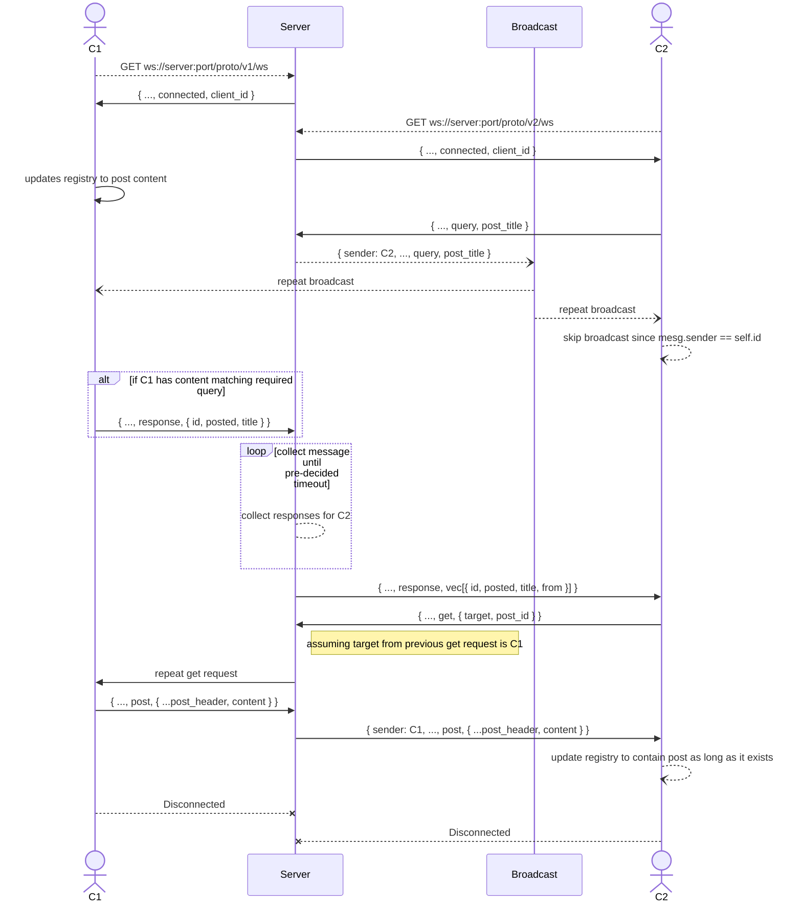

# PROTOCOL

This is the base implementation of the _Decentralized data distribution_ protocol.
The repository itself hosts a basic implementations of the server/distributor
side of the protocol.

## What is it?

The protocol relies on the connected clients to share data among themselves, and
the server itself just acts as a centralized broker of sorts for these clients
to fluently communicate. Unlike many other implementations of the peer to peer
data sharing implementations like **torrents**, in our implementation the **server
tends to do the heavy lifting**, thus allowing the clients to be as flexible as
they want to, i.e, some clients may just act as a repository for data sharing,
just like dedicated seeds in torrents.


## How does it work?

The current implementation of the server tends to allow bi-directional
communication via the use of websockets (due to team decisions). It might not be
the best medium to allow performant full duplex communication between systems,
but is much more _ergonomic (apparently)_. Data passing works by sending protocol
agnostic JSON based messages(soon to be moved to `protobuf(s)`).


### Message passing

At present there are 6 different kinds of messages that can passed around
through the network, they are as follows.

```
struct PostHeader { /* ... */ }
struct Post       { /* ... */ }

enum MessageKind {
    Query     (String),
    Connected (Uuid),

    Error    { criminal: Uuid, error: String },
    Response { target: Uuid, posts: Vec<PostHeader> },
    Post     { target: Uuid, post: Post },
    Get      { target: Uuid, id: Uuid },
}
```

Of the fore-mentioned message kinds `Connected` and `Error` are reserved for the
server/broker. No general purpose client can send them.

A general message is structured in the following method:

```jsonc
{
    "sender" : "sender-uuid",
    "time"   : "system time",
    "method" : "message kind",
    "body"   : "message body",
}
```


### What the messages mean

To explain how the actual protocol works we present a sequence diagram




# LICENSE

This project is licensed under the GNU GPL V3 License.


# NOTE

At the time this readme was written, the protocol itself is unfinished and needs
to be fleshed out significantly. The server implementation is supposed to be a
demonstration of how a server might be implemented following the protocol
guidlines.
